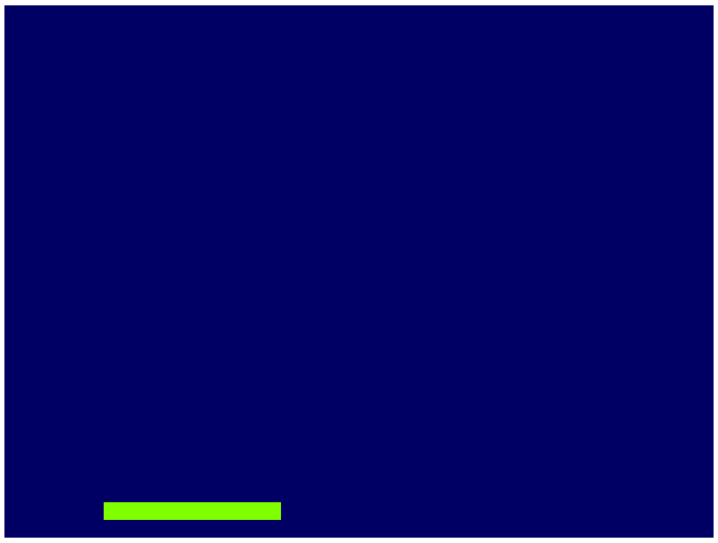
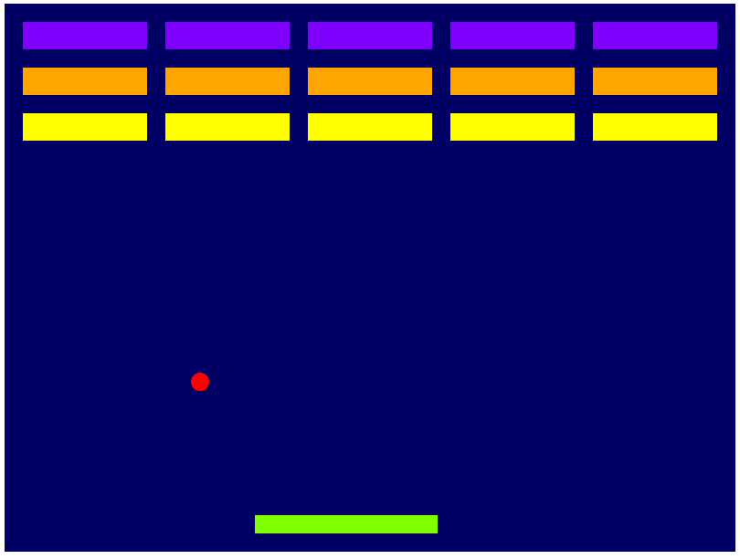

## Download and Install Excalibur

Review the [Installing Excalibur.js][docs-install] for instructions.

## Global Namespace vs. Imports

In this tutorial, we are using the global `ex.` namespace, which works within a browser environment. If you are using ES2015 modules, you would replace `ex.` with an import statement at the top of the file:

```ts
import * as ex from 'excalibur'
```

<Note>

See [notes about ES2015 imports](/docs/installation#module-loaders-and-bundlers) with module loaders and bundlers.

</Note>

## Build Your Game Script

Create a script in your project, here I’ve named it `game.js`. Excalibur games are built off of the [ex.Engine](/docs/intro) container. It is important to start the engine once you are done building your game.

<Note>

Call `game.start()` right away so you don’t forget

</Note>

```js
// game.js

// Create an instance of the engine.
// I'm specifying that the game be 800 pixels wide by 600 pixels tall.
// If no dimensions are specified the game will be fullscreen.
const game = new ex.Engine({
  width: 800,
  height: 600,
})
// todo build awesome game here

// Start the engine to begin the game.
game.start()
```

Include your game script after the excalibur script.

```html
<html>
  <head> </head>
  <body>
    <!-- Include your script at the end of the body tag -->
    <script src="excalibur-version.js"></script>
    <script src="game.js"></script>
  </body>
</html>
...
```

Open a browser and view the blank blue screen of goodness.

## Hello Excalibur: Building Breakout!

That’s cool, but let’s make something more interesting on the screen.

To do this Excalibur uses a primitive called an [Actor][docs-actor], and places actors into a [Scene][docs-scene]. Think of actors like you would the actors in a play. Actors are the primary way to draw things to the screen.

<Note>

Actors must be added to a scene to be drawn or updated! `game.add(actor)` Will add an actor to the current scene.

</Note>

<Note>

**Important!** Actors have a default anchor of (0.5, 0.5) which means their position is centered (not top-left) by default.

</Note>

```typescript
import { Actor, CollisionType, Color, Engine } from "excalibur";

// Create an instance of the engine.
const game = new Engine({
  width: 800,
  height: 600
});

// Create an actor with x position of 150px,
// y position of 40px from the bottom of the screen,
// width of 200px, height and a height of 20px
const paddle = new Actor({
  x: 150,
  y: game.drawHeight - 40,
  width: 200,
  height: 20
});

// Let's give it some color with one of the predefined
// color constants
paddle.color = Color.Chartreuse;

// Make sure the paddle can partipate in collisions, by default excalibur actors do not collide
paddle.body.collider.type = CollisionType.Fixed;

// `game.add` is the same as calling
// `game.currentScene.add`
game.add(paddle);

// Start the engine to begin the game.
game.start();
```

Open up your favorite browser and you should see something like this:



That’s neat, but this game is way more fun if things move around. Let’s make the paddle follow the mouse around in the x direction.

```typescript
// Add a mouse move listener
game.input.pointers.primary.on('move', function (evt) {
  paddle.pos.x = evt.target.lastWorldPos.x
})
```

What’s breakout without the ball? To make the ball bounce, Excalibur comes prebuilt with an “elastic” collision type that does naive elastic collisions, which is sufficient for breakout.

```typescript
// Create a ball
const ball = new Actor(100, 300, 20, 20);

// Set the color
ball.color = Color.Red;

// Set the velocity in pixels per second
ball.vel.setTo(100, 100);

// Set the collision Type to passive
// This means "tell me when I collide with an emitted event, but don't let excalibur do anything automatically"
ball.body.collider.type = CollisionType.Passive;
// Other possible collision types:
// "ex.CollisionType.PreventCollision - this means do not participate in any collision notification at all"
// "ex.CollisionType.Active - this means participate and let excalibur resolve the positions/velocities of actors after collision"
// "ex.CollisionType.Fixed - this means participate, but this object is unmovable"

// Wire up to the postupdate event
ball.on("postupdate", () => {
  // If the ball collides with the left side
  // of the screen reverse the x velocity
  if (ball.pos.x < ball.width / 2) {
    ball.vel.x *= -1;
  }

  // If the ball collides with the right side
  // of the screen reverse the x velocity
  if (ball.pos.x + ball.width / 2 > game.drawWidth) {
    ball.vel.x *= -1;
  }

  // If the ball collides with the top
  // of the screen reverse the y velocity
  if (ball.pos.y < ball.height / 2) {
    ball.vel.y *= -1;
  }
});

// Draw is passed a rendering context and a delta in milliseconds since the last frame
ball.draw = (ctx, delta) => {
  // Optionally call original 'base' method
  // ex.Actor.prototype.draw.call(this, ctx, delta)

  // Custom draw code
  ctx.fillStyle = ball.color.toString();
  ctx.beginPath();
  ctx.arc(ball.pos.x, ball.pos.y, 10, 0, Math.PI * 2);
  ctx.closePath();
  ctx.fill();
};

// Add the ball to the current scene
game.add(ball);
```

The ball will now bounce off of the paddle, but does not bounce with the side of the screen. To fix that, let’s take advantage of the `postupdate` event.

```typescript
// Wire up to the postupdate event
ball.on("postupdate", () => {
  // If the ball collides with the left side
  // of the screen reverse the x velocity
  if (ball.pos.x < ball.width / 2) {
    ball.vel.x *= -1;
  }

  // If the ball collides with the right side
  // of the screen reverse the x velocity
  if (ball.pos.x + ball.width / 2 > game.drawWidth) {
    ball.vel.x *= -1;
  }

  // If the ball collides with the top
  // of the screen reverse the y velocity
  if (ball.pos.y < ball.height / 2) {
    ball.vel.y *= -1;
  }
});
```

Don’t like square balls? Neither do we. You can create your own custom drawing function like so:

```typescript
// Draw is passed a rendering context and a delta in milliseconds since the last frame
ball.draw = (ctx, delta) => {
  // Optionally call original 'base' method
  // ex.Actor.prototype.draw.call(this, ctx, delta)

  // Custom draw code
  ctx.fillStyle = ball.color.toString();
  ctx.beginPath();
  ctx.arc(ball.pos.x, ball.pos.y, 10, 0, Math.PI * 2);
  ctx.closePath();
  ctx.fill();
};

```

<Note>

Overriding a method like this will remove any built-in Excalibur functionality. If you would like to call the original draw for example `ex.Actor.prototype.draw.call(this, ctx, delta)`

</Note>

Breakout needs some bricks to break. To do this we calculate our brick layout and add them to the current scene.

```typescript
// Build Bricks

// Padding between bricks
const padding = 20; // px
const xoffset = 65; // x-offset
const yoffset = 20; // y-offset
const columns = 5;
const rows = 3;

const brickColor = [Color.Violet, Color.Orange, Color.Yellow];

// Individual brick width with padding factored in
const brickWidth = game.drawWidth / columns - padding - padding / columns; // px
const brickHeight = 30; // px
const bricks: Actor[] = [];
for (let j = 0; j < rows; j++) {
  for (let i = 0; i < columns; i++) {
    bricks.push(
      new Actor({
        x: xoffset + i * (brickWidth + padding) + padding,
        y: yoffset + j * (brickHeight + padding) + padding,
        width: brickWidth,
        height: brickHeight,
        color: brickColor[j % brickColor.length]
      })
    );
  }
}

bricks.forEach(function (brick) {
  // Make sure that bricks can participate in collisions
  brick.body.collider.type = CollisionType.Active;

  // Add the brick to the current scene to be drawn
  game.add(brick);
});
```

When the ball collides with bricks, we want to remove them from the scene. Update the ‘precollision’ handler we previously added:

```typescript
// On collision remove the brick, bounce the ball
ball.on("precollision", function (ev) {
  if (bricks.indexOf(ev.other) > -1) {
    // kill removes an actor from the current scene
    // therefore it will no longer be drawn or updated
    ev.other.kill();
  }

  // reverse course after any collision
  // intersections are the direction body A has to move to not be clipping body B
  // `ev.intersection` is a vector `normalize()` will make the length of it 1
  // `negate()` flips the direction of the vector
  var intersection = ev.intersection.normalize();

  // The largest component of intersection is our axis to flip
  if (Math.abs(intersection.x) > Math.abs(intersection.y)) {
    ball.vel.x *= -1;
  } else {
    ball.vel.y *= -1;
  }
});
```

Finally, if the ball leaves the screen, the player loses!

```typescript
ball.on('exitviewport', function () {
  alert('You lose!')
})
```



Congratulations! You have just created your first game in Excalibur!

It's time to [get introduced][docs-intro] to the engine for more examples or advanced users can browse the [API Reference][docs-api].

<iframe src="https://codesandbox.io/embed/github/excaliburjs/sample-breakout/tree/main/?fontsize=14&hidenavigation=1&theme=dark"
     style="width:100%; height:500px; border:0; border-radius: 4px; overflow:hidden;"
     title="excaliburjs/sample-breakout"
     allow="accelerometer; ambient-light-sensor; camera; encrypted-media; geolocation; gyroscope; hid; microphone; midi; payment; usb; vr; xr-spatial-tracking"
     sandbox="allow-forms allow-modals allow-popups allow-presentation allow-same-origin allow-scripts"
   ></iframe>

[docs-install]: /docs/installation
[docs-intro]: /docs/intro
[docs-actor]: /docs/actors
[docs-scene]: /docs/scenes
[docs-api]: /docs/api/edge
