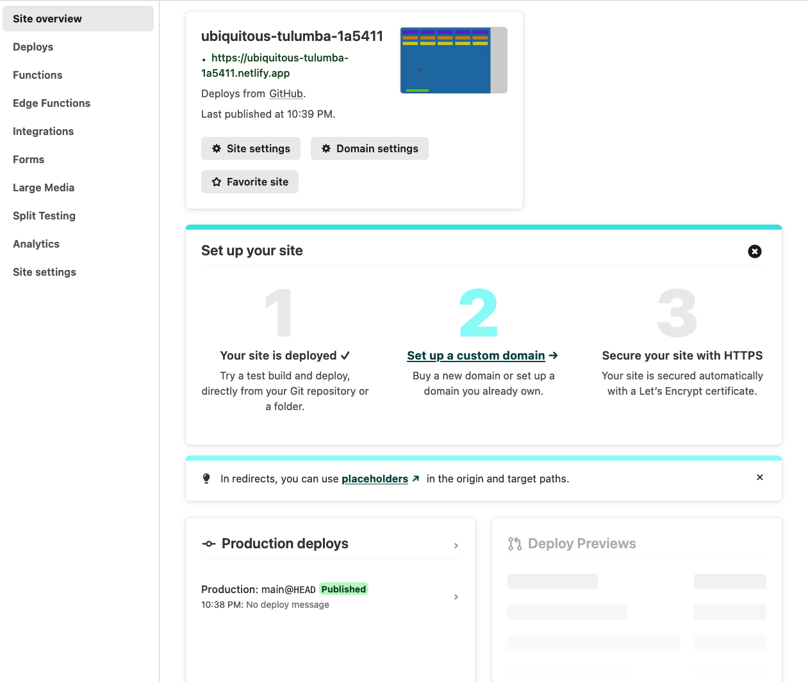
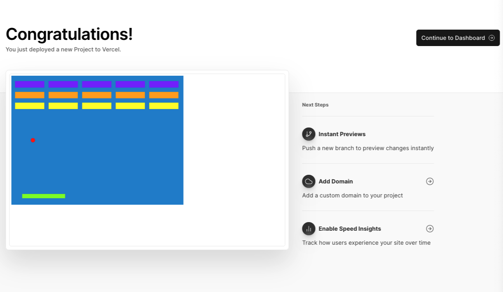

## Itch.io

Upload a zip file containing your built game

For keyboard events in cross-origin iframes there is a [known issue](https://github.com/excaliburjs/Excalibur/issues/1512) (will be fixed in v0.28.0), add this snippet to workaround

```typescript
const engine = new ex.Engine({...});
engine.start().then(() => {
  // Grab the frame's focus
  window.focus();
});
```

Read more https://itch.io/docs/creators/html5#common-pitfalls

## GitHub Pages

Example using github pages https://github.com/excaliburjs/ludum-50/blob/main/.github/workflows/main.yml

## Parcel

Be sure to set the correct public url, if you are hosting your game in sub directory like `ludum-50` off the root.

`parcel build ./index.html --dist-dir ./dist --public-url /ludum-50`

## Netlify

[Netlify](https://www.netlify.com/) is a "zero config" hosting service which offers a low effort way to host frontend projects, including Excalibur games.
It has a generous free tier but check the pricing page to make sure the plans align to your needs.

These instructions assume you have already created a Netlify account and your Excalibur project is in Github, Gitlab or Bitbucket.

It also assumes you have a build step in your `package.json`. A build step compiles your source into a package that is deployable to the web. A good example can be found in the official [breakout sample project](https://github.com/excaliburjs/sample-breakout/blob/main/package.json).

### Deploy your Excalibur game to Netlify

**Step 1** Navigate to your Netlify dashboard.

**Step 2** Navigate to "sites".

**Step 3** Click the "Add new site" button.

**Step 4** Click "Import an existing project" from the dropdown.

**Step 5** You will now be on the "Connect to Git provider" page.

The first time using Netlify you will need to authorize your Git account. The steps vary from provider to prodiver but your Git provider will guide you through the steps.

You may also choose to limit access to particular repositories.

Once authorized you will be returned to the next step within Netlify.

**Step 6** You will now be on the "Pick a repository" page.

Select the repository you would like to deploy.

**Step 7** You will now be on the "Site settings" page.

The default settings should work if you are using a structure similar to the [breakout sample project](https://github.com/excaliburjs/sample-breakout/blob/main/package.json), with a `dist` directory and a `npm run build` command in your `package.json`.

If you have a different build command or publish directory, update those settings now.

**Step 8** Click "Deploy site"

**Step 9** Once the deployment has completed, return to "Site overview" and you will see the unique URL to your deployed game. Your game is now ready to share and play!

<Note variant="success">

The great thing about Netlify is automated deployments. Every time you push a change to your main branch, it will be automatically deployed. This makes sure your players are always playing the latest and greatest version of your game.

</Note>



### Custom domains

Netlify also supports custom domains if you have purchased a domain for your game. Please [see this documentation](https://docs.netlify.com/domains-https/custom-domains) for more.

### Manual deployments on Netlify

If your game isn't available through a Git provider like Github you can instead deploy it manually.

- On your local machine run `npm run build`. This will generate an output folder, commonly called `dist`.
- Compress this `dist` folder, eg: `dist.zip` (the name is not important).
- Within Netlify, click "Add new site".
- Click "Deploy manually".
- Upload your `dist.zip` .
- Netlify will handle the rest and generate a URL for you.

The primary downside to a manual deploy is its very manual, especially if you are doing lots of updates. Each time you make a change to your game, you will need to rebuild, re-zip, and upload the new `dist.zip`

## Vercel

[Vercel](https://vercel.com) is similar to Netlify but offers a different cross section of supporting services. In the context of Excalibur games, the differences between Vercel and Netlify are negligible, and you should use the one that best suits your overall needs.

Vercel also has a generous free tier but check the pricing page to make sure the plans align to your needs.

These instructions assume you have already created a Vercel account and your Excalibur project is in Github, Gitlab or Bitbucket.

It also assumes you have a build step in your `package.json`. A build step compiles your source into a package that is deployable to the web. A good example can be found in the official [breakout sample project](https://github.com/excaliburjs/sample-breakout/blob/main/package.json).

### Deploy your Excalibur game to Vercel

**Step 1** Navigate to your Vercel dashboard.

**Step 2** Click the "Add new..." button.

**Step 3** Click "Project" from the dropdown.

**Step 4** Click your Git provider from the list.

The first time using Vercel you will need to authorize your Git account. The steps vary from provider to prodiver but your Git provider will guide you through the steps.

You may also choose to limit access to particular repositories.

Once authorized you will be returned to the next step within Vercel.

**Step 5** Click "import" next to your games repository,

**Step 6** On the "Configure Project" the default settings should work if you are using a structure similar to the [breakout sample project](https://github.com/excaliburjs/sample-breakout/blob/main/package.json), with a `dist` directory and a `npm run build` command in your `package.json`.

If you have a different build command or publish directory, update those settings now.

**Step 7** Click "Deploy".

**Step 8** Once the deployment has completed, return to "Dashboard" and you will see the unique URL to your deployed game. Your game is now ready to share and play!

<Note variant="success">

Similar to Netlify, Vercel will automatically deploy your game every time you push to the main branch.

</Note>


